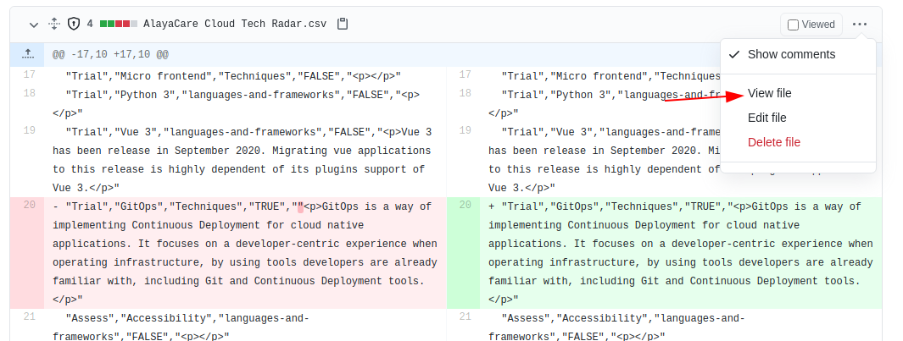
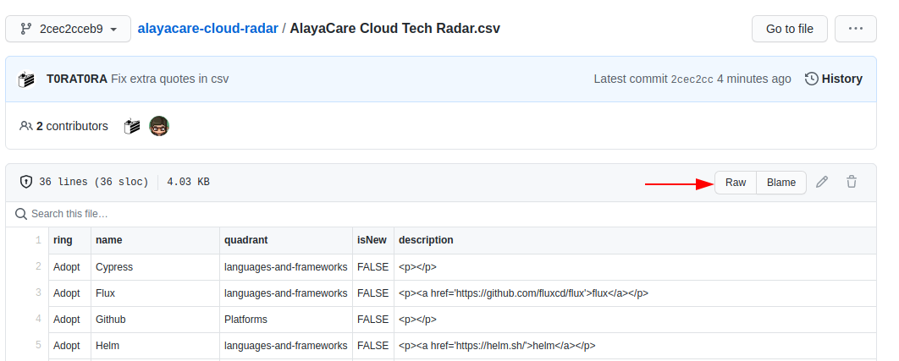

# AlayaCare Cloud Technology Radar

## Deployment

The radar can be found here: [AlayaCare Cloud Tech Radar](https://radar.thoughtworks.com/?sheetId=https%3A%2F%2Falayacare.github.io%2Falayacare-cloud-radar%2FAlayaCare%20Cloud%20Tech%20Radar.csv)  
Changes to [AlayaCare Cloud Tech Radar.csv](./AlayaCare%20Cloud%20Tech%20Radar.csv) are deployed on [Github pages](https://alayacare.github.io/alayacare-cloud-radar/AlayaCare%20Cloud%20Tech%20Radar.csv) from the `main` branch automatically.

## Contribution

### Pull request

To add/update items on the radar, open a pull request against the `main` branch.  
The source file to modify is [AlayaCare Cloud Tech Radar.csv](./AlayaCare%20Cloud%20Tech%20Radar.csv).  

Keep the rows in order based on their ring: `Adopt`, `Trial`, `Assess`, `Hold`.  
Changing the order of the rings will lead to a wrong order in the UI.  

### Preview

You can preview your changes by using the raw csv file URL from your PR.  
Get the public link of your source file:

Then use the following URL to preview your changes: [https://radar.thoughtworks.com/?sheetId=your-csv-file-url](https://radar.thoughtworks.com/?sheetId=)  
